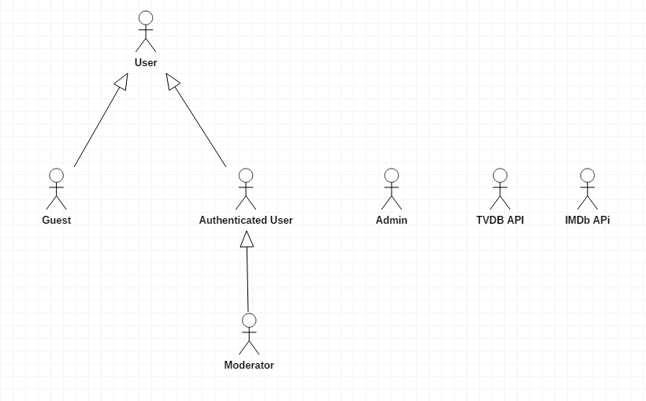

# SHOWCHAN - Collaborative News
`The goal of this project is to provide tv show and movie aficionados with daily news and updates of this media. This very system will be community-based since only registered members are allowed to both rate and comment each other's submissions, triggering healthy discussions.`

# A2: Actors and User Stories
This artifact contains the specification of the actors and their users stories, serving as agile documentation of project requirements.

## 1. Actors

For the **SHOWCHAN** system, the actors are represented in Figure 1 and described in Table 1. 

> Figure 1: Actors.

Identifier | Description | Examples
-- | -- | --
User | Generic user. Has access to all public information, which includes all news and profiles. | n/a
Guest | A user which is not authenticated. Can either register on log in the system. | n/a
Authenticated User | A user that has authenticated into his account on the system. Can upvote and downvote articles if desired, comment on any post, manage **his** comments, post a news item and manage **his** news items. | jlopes69
Moderator | An Authenticated User that has been promoted. Has all previous privileges but can also remove comments and posts made by other users if needed. | jlopes69 
Admin | Authenticated user. Responsible for the management of users and for some specific supervisory and moderation functions. | admin
`TVDB API` | `External API to extract tv show information from a trusted database.` | `TVDB`
`IMDB API` | `External API to extract movie information from a trusted database.` | `IMDB`

> Table 1: Identification of actors, including a brief description and examples.
 
## 2. User Stories

For the **SHOWCHAN** system, consider the user stories that are presented in the following sections.

 
### 2.1. User

Identifier | Name | Priority | Description
-- | -- | -- | --
US01 | Search | High |  As a *User*, I want the ability to search for all kind of news posted on the site.
US02 | Check Profiles | High | As a *User*, I want the ability to check other user's profiles.
US03 | View Home Page | High | As a *User* I want to be able to view the Home Page of the system, so that I can better understand what the website is made about.
US04 | View About Page | High | As a *User* I want to be able to view the About Page of the system, so that I can see a description of the website and its authors.
`US05` | `View Individual Post` | `High` | `As a *User* I want a more detailed view on the article and check the submission's comments.`

> Table 2: User's user stories.

### 2.2. Guest

Identifier | Name | Priority | Description
-- | -- | -- | --
US11 | Register | High | As a *Guest* I want to register myself into the system, creating an account so that I can later authenticate myself whenever I want.
US12 | Login | High | As a *Guest* I want to have the possibility to log into the system using an account that was previously created.
`US13` | `Logout` | `High` | `As a *Guest* I want to be able to finish my current session, logging out of the system.`
 
> Table 3: Guest's user stories.
 
### 2.3. Authenticated User

Identifier | Name | Priority | Description
-- | -- | -- | --
US21 | Add Friend | High | As an *Authenticated User*, I want the possibility to add other users as my friends.
US22 | Filter Information | High |  As an *Authenticated User*, I want the possibility to choose between reading news about TV shows or about movies.
US23 | Check Profile | High | As an *Authenticated User* I want to have configurable settings in order to define or change names, emails, passwords and avatar.
US24 | View/Post Comments  | High |  As an *Authenticated User*, I want to give my feedback about the existing publications.
US25 | Upvote  | High |  As an *Authenticated User*, I want to be able to give a positive rating on news that I like.
`US26` | `Downvote` | `High` | `As an *Authenticated User*, I want to be able to give a negative rating on news that I don't like.`
US27 | Share  | Medium |  As an *Authenticated User*, I want to share publications with my friends.
US28 | Post  | High |   As an *Authenticated User*, I want to write my own text and post it in the site so that everyone can read.
US29 | Check Statistics | Optional | As an *Authenticated User*, I want to be able to check my own statistics and of other users, such as Comments Posted, News Posted and Overall rating.
US30 | Exchange Messages | High | As an *Authenticated User*, I want to exchange messages with other authenticated users.
`US31` | `View Post History` | `High` | `As an *Authenticated User*, I want to see my activity (list of posts and comments).`

> Table 4: Authenticated user's user stories.

### 2.4. Moderator

Identifier | Name | Priority | Description
-- | -- | -- | --
US32 | Delete User Comments  | High | As a *Moderator* I want to delete innapropriate comments made by some users.
US33 | Delete User Posts | High | As a *Moderator* I mant to delete innapropriate posts made by some users.
US34 | Change Content Tags | Medium | As a *Moderator* I want to change a news items' tag if it's wrongfully used.

> Table 5: Moderator's user stories.

### 2.5. Admin

Identifier | Name | Priority | Description
-- | -- | -- | --
US41 | Name Moderators | High | As an *Admin* I want to elect Moderators to my system so that they can help manage the community.
<del>US42 | <del>Accept User | <del>High | <del>As an *Admin* I want to control who uses my system and the information that they need to give me so that I can verify they meet my requirements.
US42 | Ban Users | High | As an *Admin* I want to have the ability to ban Users, preventing them from reusing the system.
`US43` | `Enter Admin Control Panel` | `High` | `As An *Admin* I want to have a personalized page to manage all users and to check the system usage statistics.`
 
> Table 6: Admin's user stories. 

## A1. Annex: Supplementary requirements
This annex contains business rules, technical requirements and other non-functional requirements on the project.
 
### A1.1. Business rules
A business rule defines or constrains one aspect of the business, with the intention of asserting business structure or influencing business behaviour.

Identifier | Name | Description
-- | -- | --
<del>BR01 | <del>Profit | <del>Users must not profit when posting news and/or comments or advertise their own content.
<del>BR02 | <del>Credibility | <del>The content of the website must be consistent and professional.
<del>BR03 | <del>Convenience | <del>The content present on the website must match the interests of its users and at the same time convering the largest number of people who may be interested on it.
<del>BR01 | <del>Profanity | <del>Users should not post content that is innapropriate, such as pornographic or racist news.
`BR01` | `Banishment` | `When a user is banned from the site all related comments and submissions are removed.`
`BR02` | `Submission Removal` | `When a submission is deleted, all associated comments are removed.`
`BR03` | `Downvote Threshold` | `When a submission/comment reaches a certain number of downvotes, the content is automatically flagged as controversial and is be filtered out.`
 
### A1.2. Technical requirements
Technical requirements are concerned with the technical aspects that the system must meet, such as performance-related issues, reliability issues and availability issues.

Identifier | Name | Description
-- | -- | --
TR01 | Availability | The system must be available practically 24 hours a day.
TR02 | Accessibility | The system must ensure that everyone can access the pages, regardless of whether they have any handicap or not, or the Web browser they use.
TR03 | Usability | The system should be simple, easy to use, user-friendly and easily navigable. The user must be able to find the intended content without any difficulty. Web pages must be uniform.
TR04 | Performance | The system should have response times shorter than 2s to ensure the user's attention. The performance of the website must be optimal incase of huge loads and for that, appropriate load balancing must be done to achieve this.
TR05 | Web application | The system should be implemented as a Web application with dynamic pages (HTML5, JavaScript, CSS3 and PHP).
<del>TR06 | <del>Portability | <del>The server-side system should work across multiple platforms (Linux, Mac OS, etc.).
TR06 | Database | The PostgreSQL database management system must be used.
TR07 | Security | The system shall protect information from unauthorised access through the use of an authentication and privilege verification system as well as security measures to prevent attackers. All the information about the registered users must be securely stored in the central base.
TR08 | Robustness | The system must be prepared to handle and continue operating when runtime errors occur.
TR09 | Scalability | The system must be prepared to deal with the growth in the number of users and corresponding operations.
TR10 | Ethics | The system must respect the ethical principles in software development (for example, the password must be stored encrypted to ensure that only the owner knows it).
TR11 | Development | Git should be used to control software version envelopment.
TR12 | Functionality | An Authenticated User must be able to maintain his/her session information for a certain period of time of inactive session. All website options must be provided disregarding the time of log in.
TR13 | Reliability | In the case of maintenance, the server(s) must be operable readily allowing users to access all the resources of the website anytime.
TR14 | Supportability | It is necessary that the website is compatible with almost all browsers. If there are plug-ins enclose within the website, these must be compatible with the browsers. In case of any incompatibility there must be a troubleshooting instruction to resolve the problem.
TR15 | Design Constraints | Provide relevant "guide rails" for users to ensure efficient interaction. It will be considered size, scale, proportion, emphasis and state helping creating hierarchy and guide the user.
 
### A1.3. Restrictions
A restriction on the design limits the degree of freedom in the search for a solution.

Identifier | Name | Description
-- | -- | --
C01 | Deadline | The project must be developed throughout the semester and finished before the end of it.
<del>C02 | <del>Login Only | <del>Users can only comment, rank, share, post and do other authenticated priveleges if they first log in.
<del>C03 | <del>Website HTTP Response | <del>Specify the HTTP responses sent according the website states. Message "200" when the page returned is the correct page or "503" when the page is not available.

***
 
## Revision history
Changes made to the first submission:
1. Added a small **paragraph** detailing the **project's intent**;
2. Divided the **API actor into two distinct actors** for each database used (TVDB and IMDB);
3. Multiple small sentence structuring; 
4. Removed **multiple nouns** from the user stories, replacing them with **verbs** (e.g. Admin Navigation -> Enter Admin Control Panel);
5. Removed **Profit**,**Credibility** and **Convenience** business rules;
6. Added **Banishment** business rule;
7. Removed **Login Only** and **HTTP Response** restrictions;
8. Removed **Portability** as technical requirement;
9. Changed US23 in order to give it a **better name**;
10. Changed US22 and US25 so that they have a more **accurate description**;
11. Added US05, US13, US26 and US44;
12. Added **View Post History** User Story (US31).
 
***
 
**GROUP1742**, 16/02/2018  

Bernardo José Coelho Leite, 201404464  
José Pedro da Silva e Sousa Borges, 201503603  
Miguel Mano Fernandes, 201503538  
Ventura de Sousa Pereira, 201404690
