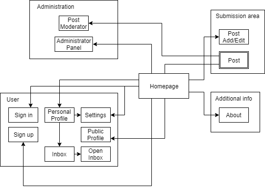

# SHOWCHAN - Collaborative News
The goal of this project is to provide tv show and movie aficionados with daily news and updates of this media. This very system will be community-based since only registered members are allowed to both rate and comment each other's submissions, triggering healthy discussions.

# A3: User Interface Prototype

This user interfaces prototype (or horizontal prototype) has the following goals:

* Help to identify and describe the user requirements, and raise new ones;
* Preview and empirically test the user interface of the product to be developed;
* Enable quick and multiple iterations on the design of the user interface.

This artefact includes three elements:

* Overview of the interface elements and features common to all pages;
* Overview of the information system from the viewpoint of the users (sitemap); and
* Identification and description of the main interactions with the system (at least two), organized as sequences of screens (storyboards).
The interface's descriptions are presented on the end of the document.

## 1. Interface and common features

**SHOWCHAN** is a web application based on HTML5, JavaScript and CSS. The user interface was implemented using the Bootstrap framework.
 
> Screenshots highlighting the main elements of the interface, for desktop and mobile.

## 2. Sitemap
 
A **sitemap** is a visual representation of the **relationship between the different pages** of a website that shows how all the information fits together.

The sitemap gives the project team an idea of how the website is going to be build by helping to **clarify the information hierarchy**.

In this diagram, page stacks are represented as **double outline rectangles**.
 
## 3. Storyboards
 
> Storyboards for the main use cases of the system.
> Do not include trivial use cases.
 
## 4. Interfaces
 
> Screenshots, structured in subsections, including a reference, a description and a URL to the working version.
 
### UI01: Home

### UI02: Sign in

### UI03: Sign up

### UI04: Post

### UI05: Post Add/Edit

### UI06: Personal Profile

### UI07: Public Profile

### UI08: Inbox

### UI09: Open Inbox

### UI10: Post Moderator

### UI11: Administrator Panel

### UI12: Settings

### UI13: About
 
***
 
## Revision history
 
No changes to show.
 
***
 
GROUP1742, 04/03/2018
 
> Bernardo José Coelho Leite, up201404464@fe.up.pt
> José Pedro da Silva e Sousa Borges, up201503603@fe.up.pt
> Miguel Mano Fernandes, up201503538@fe.up.pt
> Ventura de Sousa Pereira, up201404690@fe.up.pt
