# SHOWCHAN - Collaborative News
The goal of this project is to provide tv show and movie aficionados with daily news and updates of this media. This very system will be community-based since only registered members are allowed to both rate and comment each other's submissions, triggering healthy discussions.

# A3: User Interface Prototype

This user interfaces prototype (or horizontal prototype) has the following goals:

* Help to identify and describe the user requirements, and raise new ones;
* Preview and empirically test the user interface of the product to be developed;
* Enable quick and multiple iterations on the design of the user interface.

This artefact includes three elements:

* Overview of the interface elements and features common to all pages;
* Overview of the information system from the viewpoint of the users (sitemap); and
* Identification and description of the main interactions with the system (at least two), organized as sequences of screens (storyboards).
The interface's descriptions are presented on the end of the document.

## 1. Interface and common features

**SHOWCHAN** is a web application based on HTML5, JavaScript and CSS. The user interface was implemented using the Bootstrap framework.

These are the **main structural points** highlighted on the image which are present in most pages throughout the website:
1. Logo
2. Search bar
3. Navigation items
4. Content
5. Footer

Some design choices lie in:
* The use of **bold, serif** fonts for **headlines** and **thinner, sans-serif** fonts for **body content** for better contrast;
* The usage of **bright red** coloring for **administrator/moderation** navigation links;
* Different sections have **clearly distinct styles** in order to highlight distinct hierarchies of information, and assist with the **visual flow**.

  
  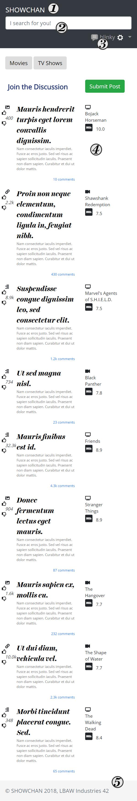 

Figure 1: Interface's guidelines.

## 2. Sitemap
 
A **sitemap** is a visual representation of the **relationship between the different pages** of a website that shows how all the information fits together.

The sitemap gives the project team an idea of how the website is going to be build by helping to **clarify the information hierarchy**. In this diagram, page stacks are represented as **double outline rectangles**.

Figure 2: Sitemap.
 
## 3. Storyboards
Storyboards are presented to represent some of the main interactions with the system using a sequence of interfaces and explaining how navigation is done between them.

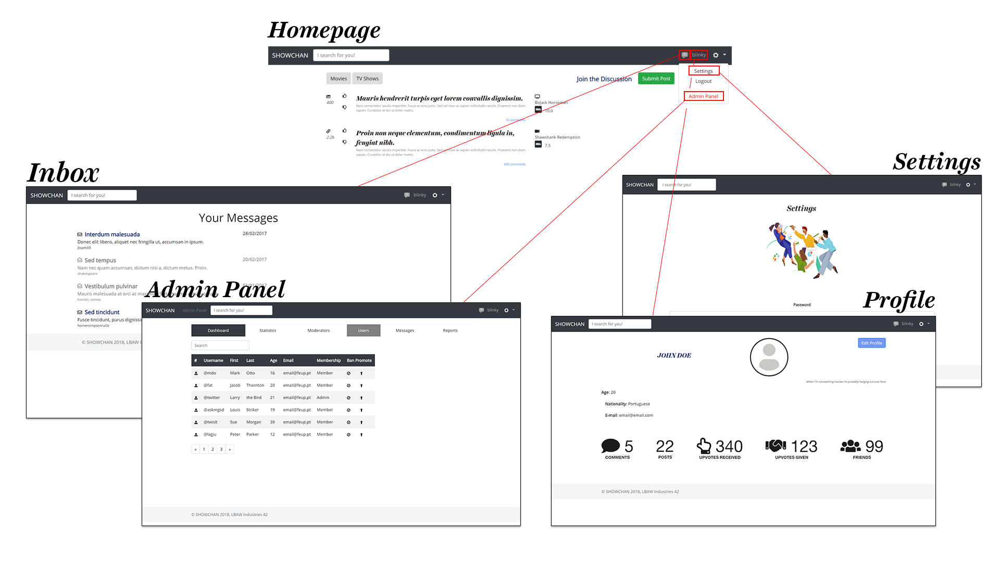Figure 3: Wireflow centered on the user's options.

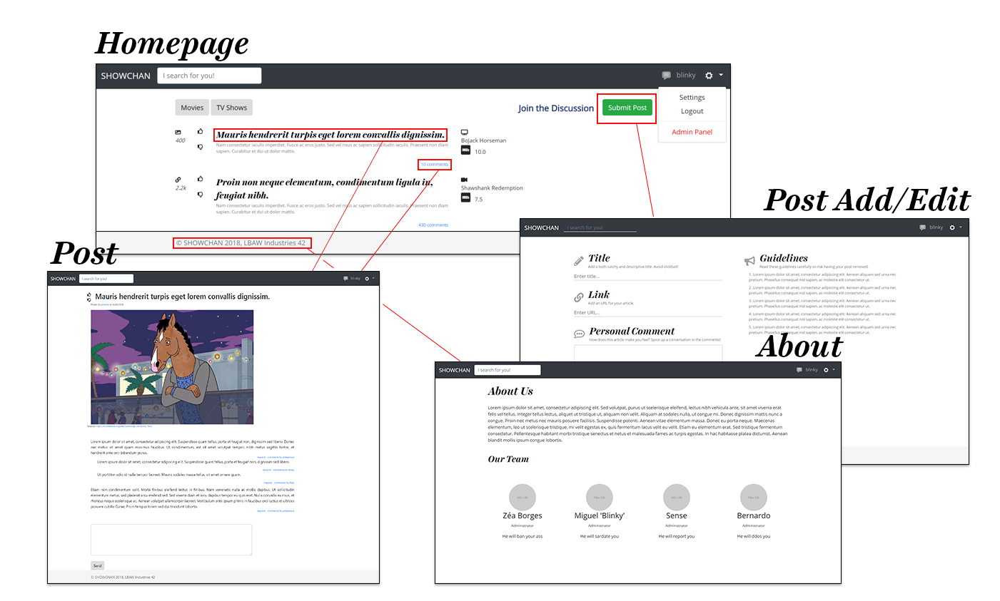Figure 4: Wireflow centered on the reader's options.

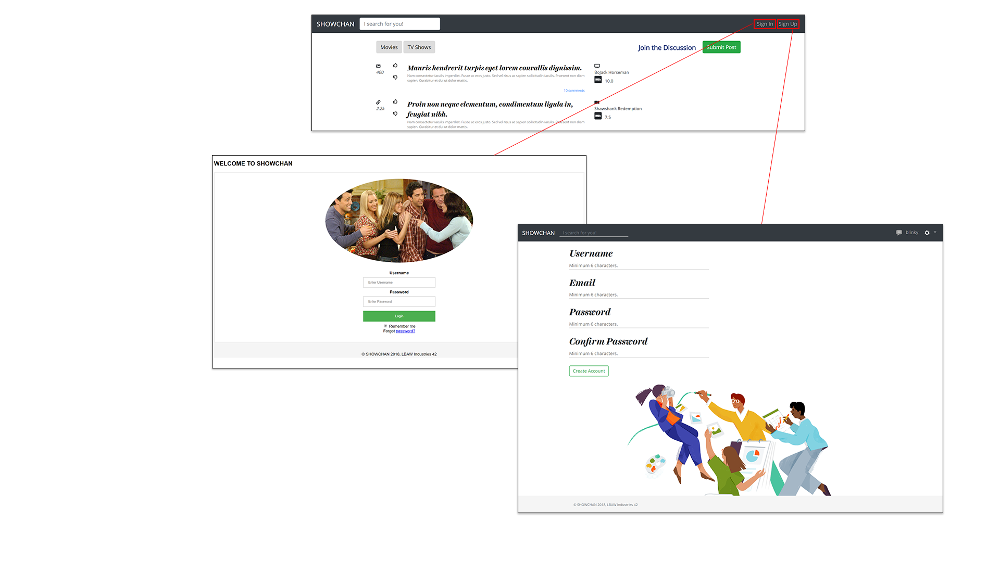Figure 5: Wireflow for the sign-in and sign-up interaction.

## 4. Interfaces
 
> Screenshots, structured in subsections, including a reference, a description and a URL to the working version.
 
### UI01: Homepage (Authenticated User)
The landing page of the website, which is virtually identical to the **guest** homepage, with the only exception the navigation items, which **link to the authenticated user's profile** and **settings**.  
**[Navigate to webpage](https://zepedrob16.github.io/lbaw1742/artefacts/artefact-3/homepage.html)**.  

  
  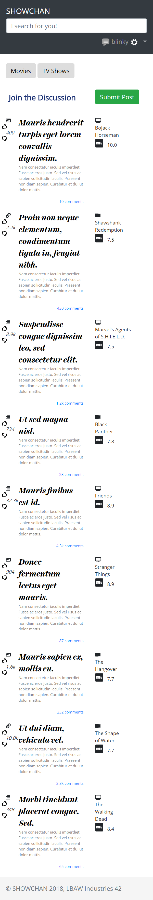 

Figure 6: Homepage (Authenticated User).

### UI02: Homepage (Guest)
Identical to the previous page besides the header which includes both **sign up** and **sign in** options.  
**[Navigate to webpage](https://zepedrob16.github.io/lbaw1742/artefacts/artefact-3/homepage-guest.html)**.

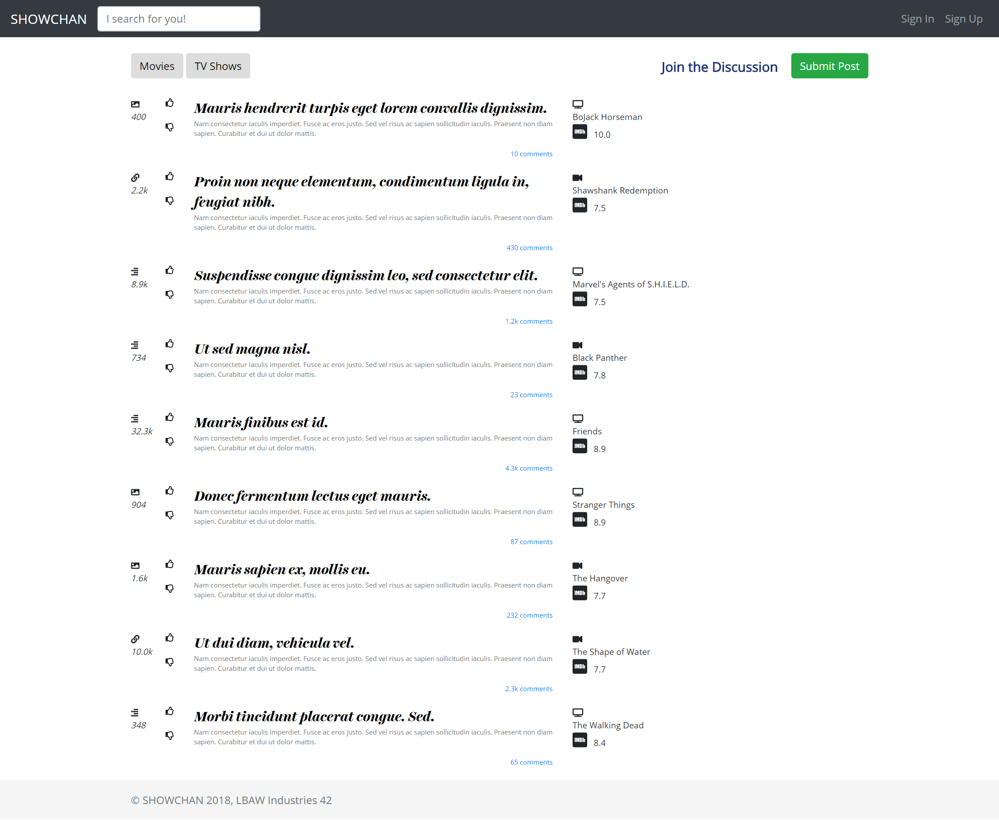

Figure 7: Homepage (Guest).

### UI03: Sign in
The sign in page requires both a **username** and **password**. It also provides the option to **remember the credentials** for future logins as well as a **retrieve password** option in case a user has forgotten its password.  
**[Navigate to webpage](https://zepedrob16.github.io/lbaw1742/artefacts/artefact-3/signin.html)**.

  
  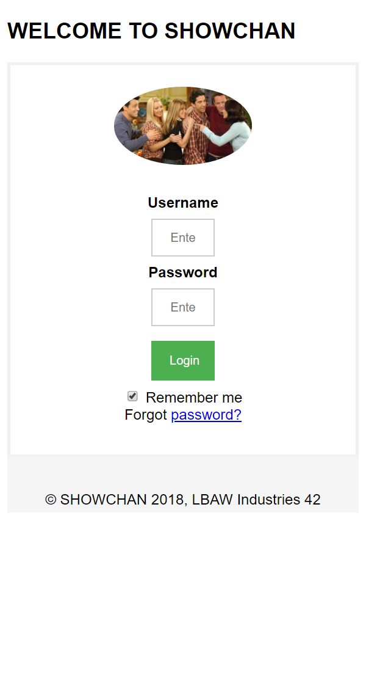 

Figure 8: Sign in.

### UI04: Sign up
The sign up page requires a valid **username**, **email**, **password** and **password confirmation**.  
**[Navigate to webpage](https://zepedrob16.github.io/lbaw1742/artefacts/artefact-3/signup.html)**.

  
   

Figure 9: Sign up.

### UI05: Post (Text)
The Post (Text) page refers to a specific text-based post written by a user.  
**[Navigate to webpage](https://zepedrob16.github.io/lbaw1742/artefacts/artefact-3/post.html)**.

  
  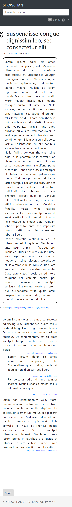 

Figure 10: Post (Text)

### UI06: Post (Image)
The Post (Image) page refers to a specific image-based post written by a user.  
**[Navigate to webpage](https://zepedrob16.github.io/lbaw1742/artefacts/artefact-3/post-image.html)**.

  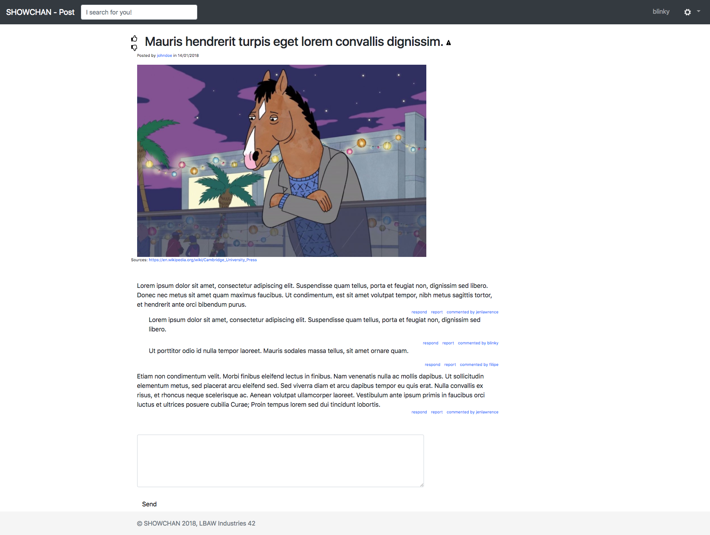
  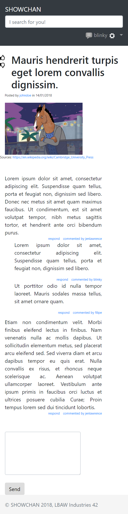 

Figure 11: Post (Image)

### UI07: Post (Link)
The Post (Link) page refers to a specific link-based post written by a user.  
**[Navigate to webpage](https://zepedrob16.github.io/lbaw1742/artefacts/artefact-3/post-link.html)**.

  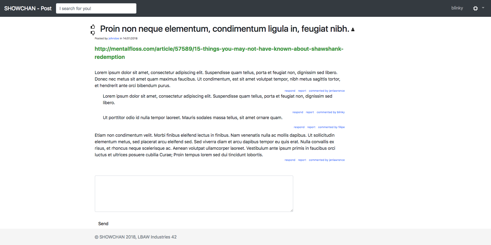
  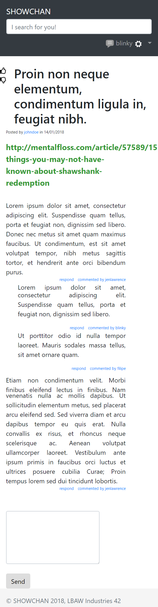 

Figure 12: Post (Link)

### UI08: Post (Moderator)
The Post (Moderator) page refers to a specific post written by a user as seen by a Moderator.  
**[Navigate to webpage](https://zepedrob16.github.io/lbaw1742/artefacts/artefact-3/post-moderator.html)**.

  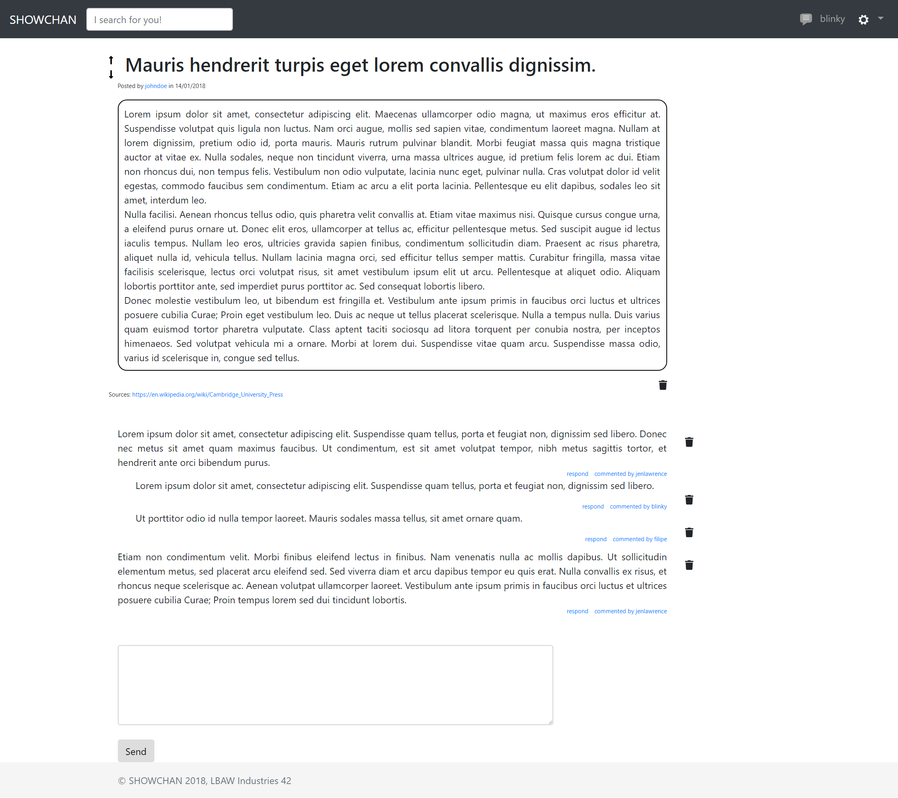
  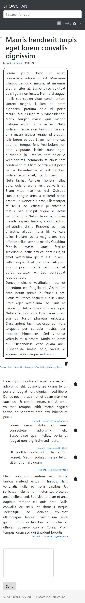 

Figure 13: Post (Moderator)

### UI09: Post Add/Edit
The Post Add/Edit Page refers to the page which is used to create a post or edit information in a previously created one.  
**[Navigate to webpage](https://zepedrob16.github.io/lbaw1742/artefacts/artefact-3/sub-params.html)**.

  
  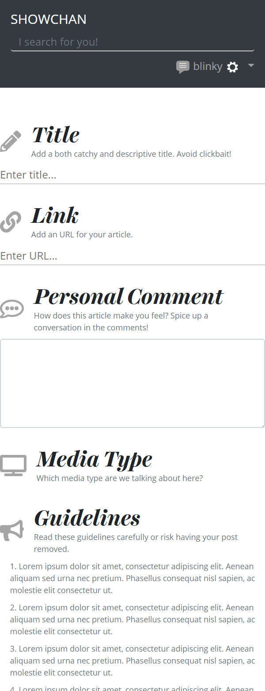 

Figure 14: Post Add/Edit

### UI10: Personal Profile
The Personal Profile page displays the user's information.  
**[Navigate to webpage](https://zepedrob16.github.io/lbaw1742/artefacts/artefact-3/profile.html)**.

  
   

Figure 15: Personal Profile

### UI11: Public Profile
The Public Profile page displays a user's information as seen by a different user.  
**[Navigate to webpage](https://zepedrob16.github.io/lbaw1742/artefacts/artefact-3/public_profile.html)**.

  

Figure 16: Public Profile

### UI12: Inbox
The Inbox page refers to the inbox of the current user, containing all messages exchanged with other users.  
**[Navigate to webpage](https://zepedrob16.github.io/lbaw1742/artefacts/artefact-3/inbox.html)**.

  
   

Figure 17: Inbox

### UI13: Open Message Inbox
The Open Message Inbox page displays the current user's exchanged messages with a specific user.  
**[Navigate to webpage](https://zepedrob16.github.io/lbaw1742/artefacts/artefact-3/open_inbox.html)**.

  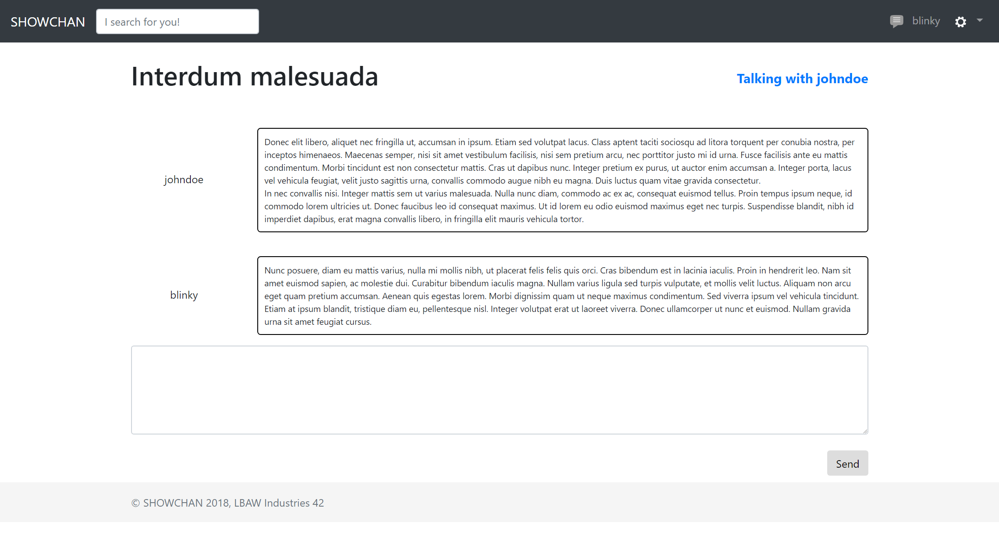
   

Figure 18: Open Message Inbox

### UI14: Administrator Panel
The Administrator Panel page displays the Administrator's page where they can control all users and information regarding the website.  
**[Navigate to webpage](https://zepedrob16.github.io/lbaw1742/artefacts/artefact-3/admin.html)**.

  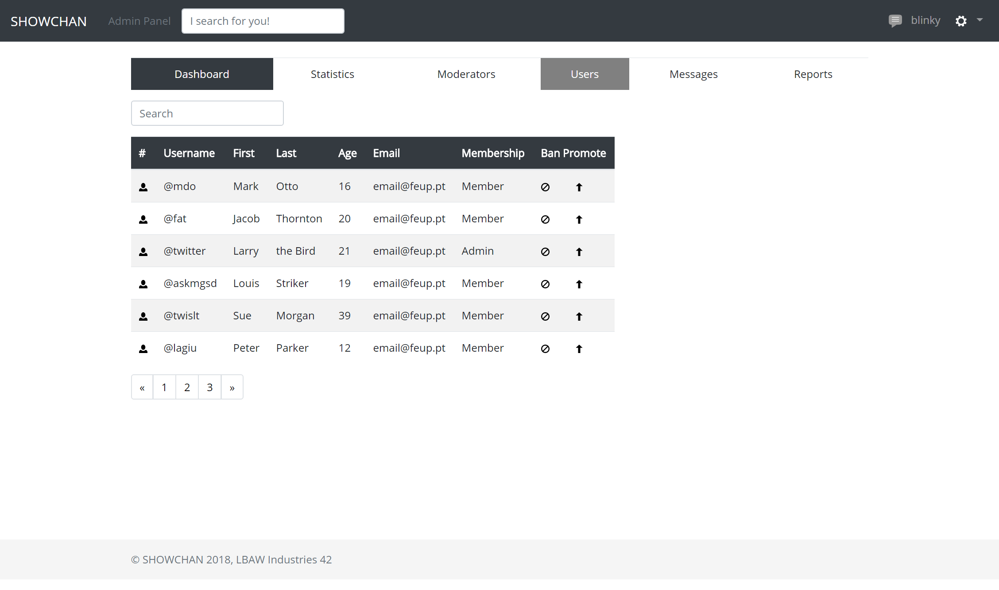
  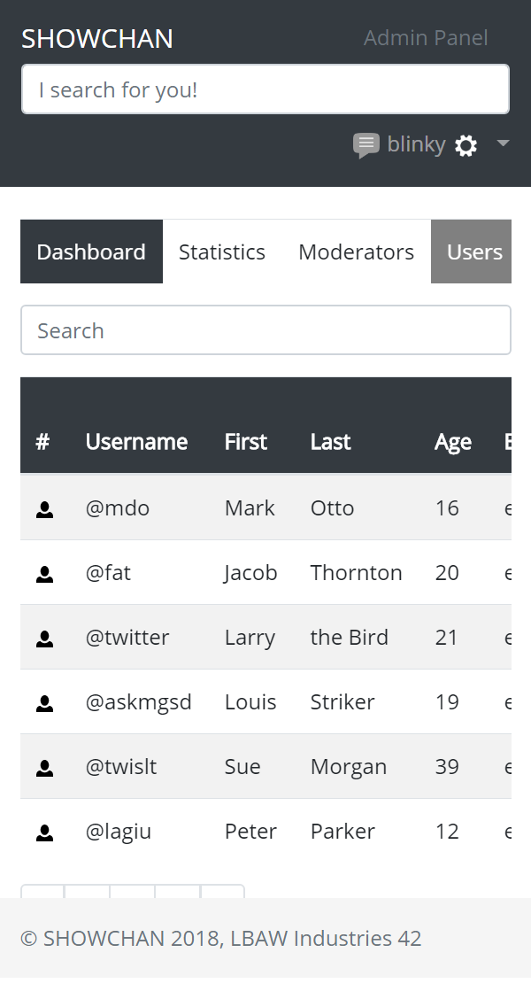 

Figure 19: Administrator Panel

### UI15: Settings
The Settings page is a page where a user can change settings regarding their profile.  
**[Navigate to webpage](https://zepedrob16.github.io/lbaw1742/artefacts/artefact-3/settings.html)**.

  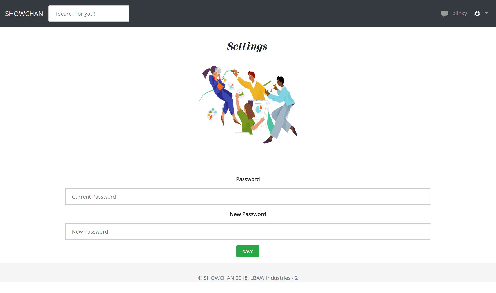
  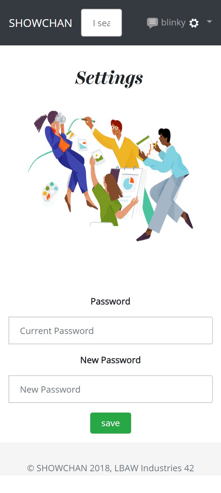 

Figure 20: Settings

### UI16: About
The About page displays information regarding the creators of the website.  
**[Navigate to webpage](https://zepedrob16.github.io/lbaw1742/artefacts/artefact-3/about.html)**.

  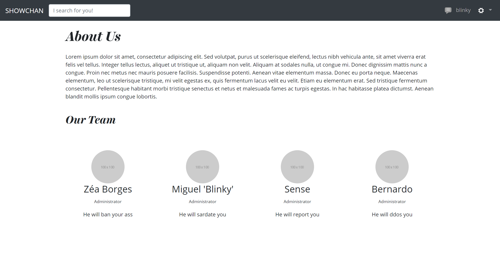
  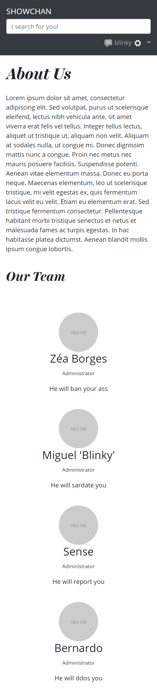 

Figure 21: About

***
 
## Revision history
 
* Added mobile representation of interface and common features.
* Slight text organization on interface and common features.
* Reimagined sitemap with better organized areas, slight fixes and less clutter.
 
***
 
GROUP1742, 04/03/2018
 
> Bernardo José Coelho Leite, up201404464@fe.up.pt  
> José Pedro da Silva e Sousa Borges, up201503603@fe.up.pt  
> Miguel Mano Fernandes, up201503538@fe.up.pt  
> Ventura de Sousa Pereira, up201404690@fe.up.pt  
