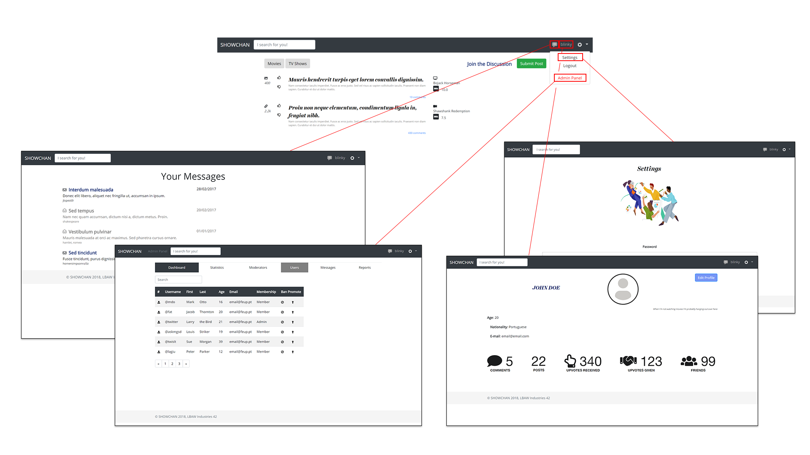
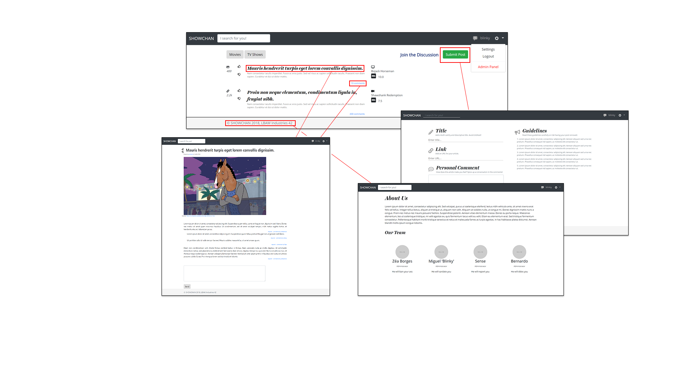
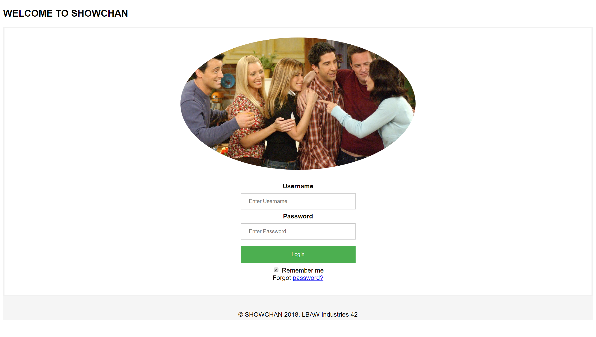
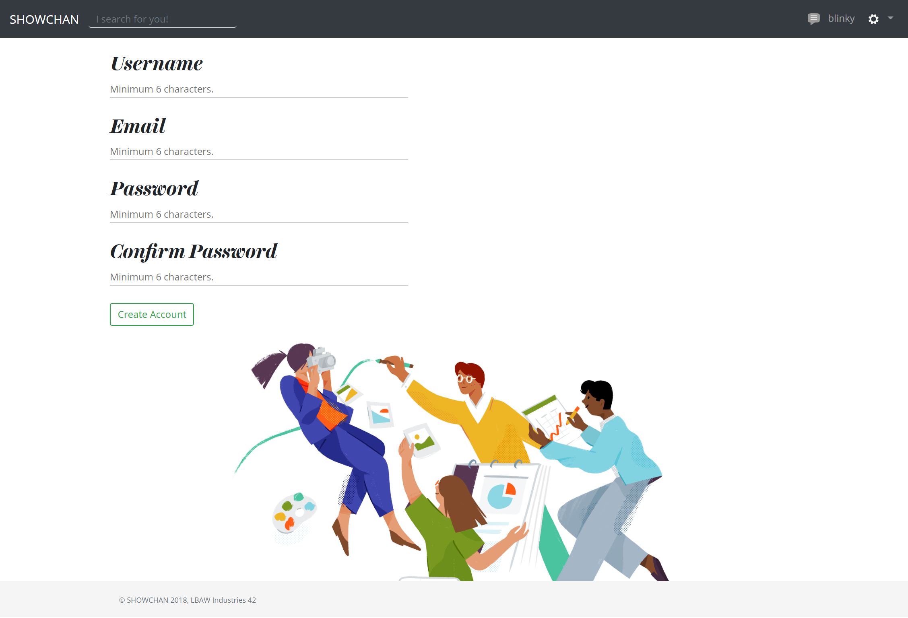
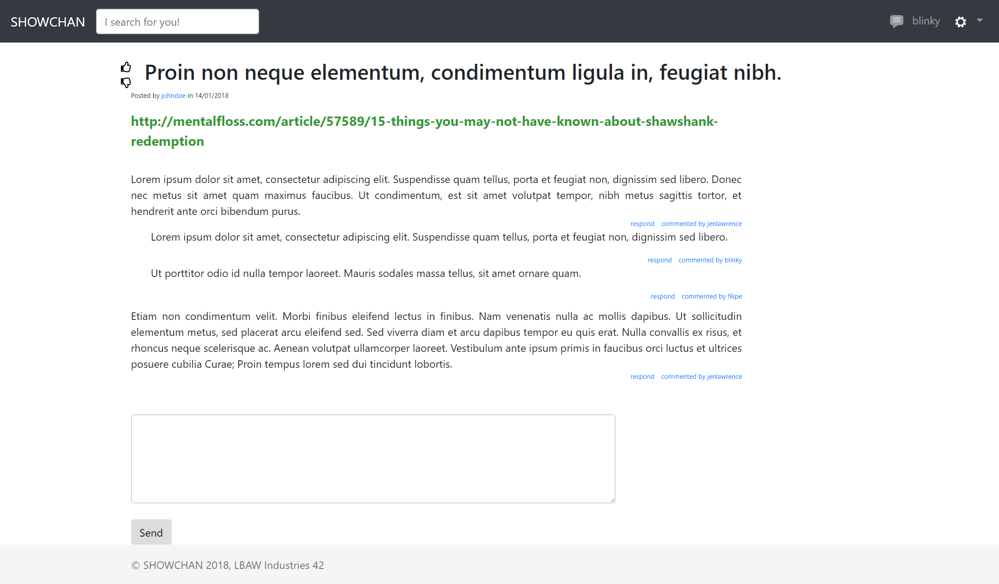
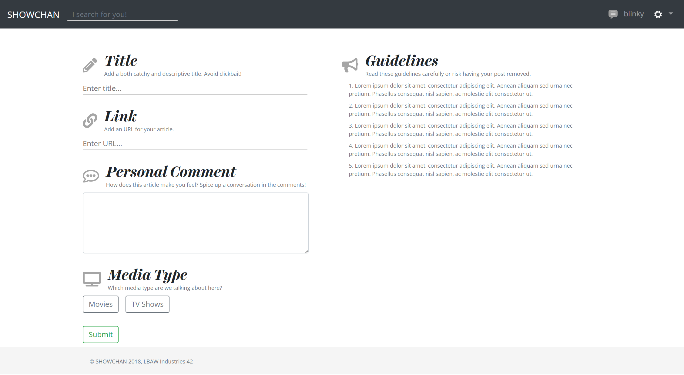
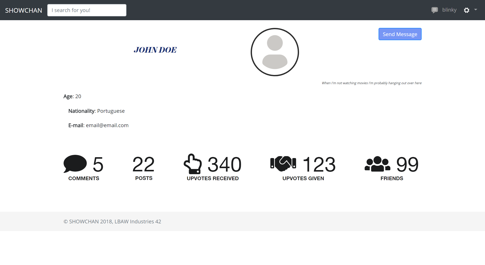
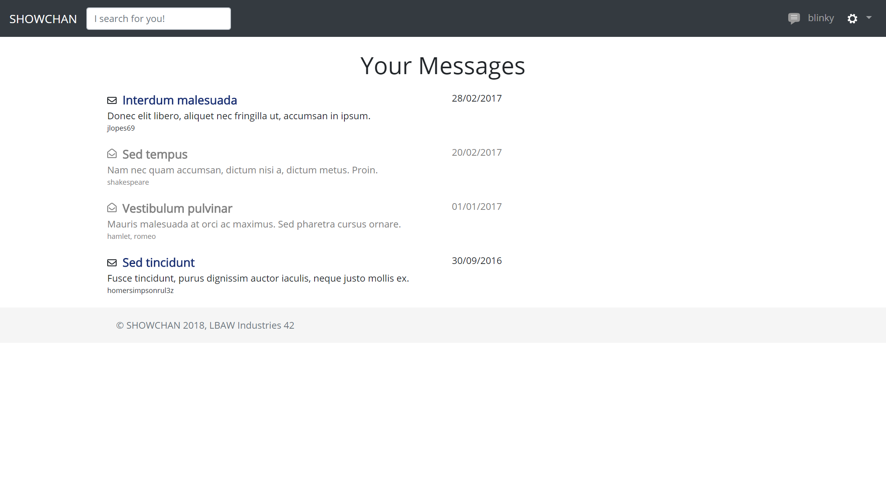

# SHOWCHAN - Collaborative News
The goal of this project is to provide tv show and movie aficionados with daily news and updates of this media. This very system will be community-based since only registered members are allowed to both rate and comment each other's submissions, triggering healthy discussions.

# A3: User Interface Prototype

This user interfaces prototype (or horizontal prototype) has the following goals:

* Help to identify and describe the user requirements, and raise new ones;
* Preview and empirically test the user interface of the product to be developed;
* Enable quick and multiple iterations on the design of the user interface.

This artefact includes three elements:

* Overview of the interface elements and features common to all pages;
* Overview of the information system from the viewpoint of the users (sitemap); and
* Identification and description of the main interactions with the system (at least two), organized as sequences of screens (storyboards).
The interface's descriptions are presented on the end of the document.

## 1. Interface and common features

**SHOWCHAN** is a web application based on HTML5, JavaScript and CSS. The user interface was implemented using the Bootstrap framework.

These are the **main structural points** highlighted on the image which are present in most pages throughout the website:
1. Logo
2. Search bar
3. Navigation items
4. Content
5. Footer

Some design choices lie in:
* The use of **bold, serif** fonts for **headlines** and **thinner, sans-serif** fonts for **body content** for better contrast;
* The usage of **bright red** coloring for **administrator/moderation** navigation links;
* Different sections have **clearly distinct styles** in order to highlight distinct hierarchies of information, and assist with the **visual flow**.

## 2. Sitemap
 
A **sitemap** is a visual representation of the **relationship between the different pages** of a website that shows how all the information fits together.

The sitemap gives the project team an idea of how the website is going to be build by helping to **clarify the information hierarchy**.

In this diagram, page stacks are represented as **double outline rectangles**.
 
## 3. Storyboards

 
## 4. Interfaces
 
> Screenshots, structured in subsections, including a reference, a description and a URL to the working version.
 
### UI01: Homepage (Authenticated User)
The landing page of the website, which is virtually identical to the **guest** homepage, with the only exception the navigation items, which **link to the authenticated user's profile** and **settings**.

### UI02: Homepage (Guest)
Identical to the previous page besides the header which includes both **sign up** and **sign in** options.

### UI03: Sign in
The sign in page requires both an **username** and **password**. It also provides the option to **remember the credentials** for future logins as well as a **retrieve password** option in case a user has forgotten its password.

### UI04: Sign up
The sign up page requires a valid **username**, **email**, **password** and **password confirmation**.

### UI05: Post (Text)

### UI06: Post (Image)

### UI07: Post (Link)

### UI08: Post (Moderator)

### UI09: Post Add/Edit

### UI10: Personal Profile

### UI11: Public Profile

### UI12: Inbox

### UI13: Open Message Inbox

### UI14: Administrator Panel

### UI15: Settings

### UI16: About

 
***
 
## Revision history
 
No changes to show.
 
***
 
GROUP1742, 04/03/2018
 
> Bernardo José Coelho Leite, up201404464@fe.up.pt
> José Pedro da Silva e Sousa Borges, up201503603@fe.up.pt
> Miguel Mano Fernandes, up201503538@fe.up.pt
> Ventura de Sousa Pereira, up201404690@fe.up.pt
