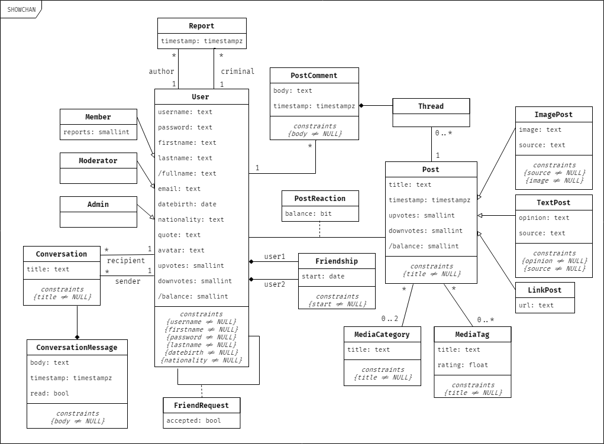

# SHOWCHAN - Collaborative News
The goal of this project is to provide tv show and movie aficionados with daily news and updates of this media. This very system will be community-based since only registered members are allowed to both rate and comment each other's submissions, triggering healthy discussions.

# A4: Conceptual Data Model

## 1. Class diagram

 
## 2. Additional Business Rules
Here are additional business rules the project required after further inspection.  

| Identifier | Name | Description |
| ---------- | ---- | ----------- |
| .          | .    | .           |
 
## Revision history
 
No changes to show.
 
***
 
GROUP1742, 06/03/2018
 
> Bernardo José Coelho Leite, up201404464@fe.up.pt  
> José Pedro da Silva e Sousa Borges, up201503603@fe.up.pt  
> Miguel Mano Fernandes, up201503538@fe.up.pt  
> Ventura de Sousa Pereira, up201404690@fe.up.pt  
